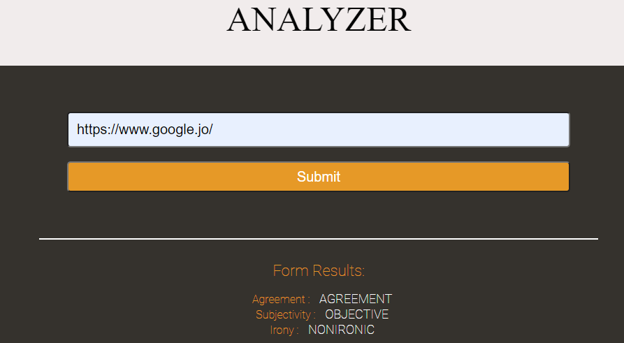

# Evaluate a news article with Natural Language Processing


## Table of Contents
- [Description](#description)
- [Website](#website-interface)
- [Build Tools](#build-tools)
- [Installation](#installation)
- [Author Info](#author-info)


 ---

### Website interface




_____

## Description
We will be building web tool that allows users to run Natural Language Processing (NLP) on articles or blogs found on other websites. Using Semantic Analysis API from **[Meaning Cloud](https://www.meaningcloud.com/)**.
  
  
###### [Back To The Top](#evaluate-a-news-article-with-natural-language-processing)

---


## Build Tools
* HTML
* CSS
* JavaScript
* Node
* Express
* Webpack
* meaningcloud API
* Jest
* Workbox

###### [Back To The Top](#evaluate-a-news-article-with-natural-language-processing)
---
## Installation
Make sure Node and npm are installed from the terminal.
```
node -v
npm -v
```

1. Move to the project folder
```
cd <project directory>
```
2. Clone the repo
```
git clone https://github.com/Siham2000/evaluate-news-nlp.git
```
3. Install npm
```
npm install
```
4. Install loaders and plugins
```
# Choose the necessary installation for your development mode
npm i -D @babel/core @babel/preset-env babel-loader
npm i -D style-loader node-sass css-loader sass-loader
npm i -D clean-webpack-plugin
npm i -D html-webpack-plugin
npm i -D mini-css-extract-plugin
npm i -D optimize-css-assets-webpack-plugin terser-webpack-plugin
```
###### [Back To The Top](#evaluate-a-news-article-with-natural-language-processing)


 ## Author Info
---
* Twitter  - [@sihamAnanzh](https://mobile.twitter.com)

* Instagram -[@Siham_ananzeh](https://mobile.twitter.com)


---

###### [Back To The Top](#evaluate-a-news-article-with-natural-language-processing)
